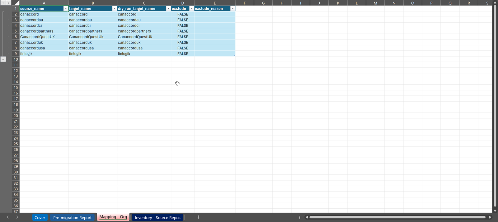
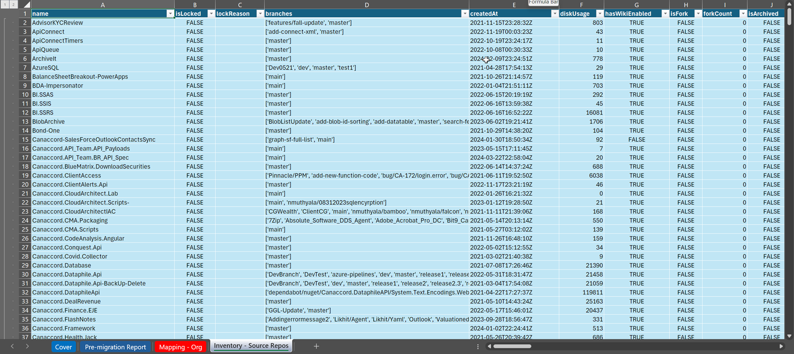

# InfoMagnus GitHub Migration Automator CLI

The IM GitHub Migration Automator is a GitHub CLI-based tool designed to help you plan and execute GitHub-to-GitHub migrations.

Specifically, the tool has been used to help plan and execute the StreamCo and CanacCord GHEC-to-GHEC EMU migrations.

## Overview

`gh migrate` consists of the following commands:
- `start` - Creates a migration workbook
- `stats` - Captures stats on the source/target environments
- `load` - Load `.csv` files into migration workbook
- `get logs` - Download migration logs
- `report` - Generate reports

## Philosophy

The `gh migrate` workflow, outlined below, leverages pre-defined filepaths and version control to reduce the overhead of managing stats and logs across the pre-migration, dry-run(s), and production migration(s) phase(s).

The workflow creates a branch named `engagement`, which all steps work out of.

Each command generates a well-named commit, which allows you to keep track of files throughout the engagement.


## Installation

`gh extension install im-infomagnus/gh-migrate`

**NOTE:** This tool is meant to be run in a Visual Studio Code devcontainer or GitHub Codespaces.

## Usage

During an engagement the tool is used as follows:

### Step 1: Start

Begin a migration by forking this repository and `git clone`'ing a local copy.

Type `gh migrate start` to create a "migration workbook".

The initialized workbook is placed in `report/InfoMagnus - Migration Workbook.xlsx`.

The "migration workbook" is an Excel workbook which all subsequent `gh migrate` workflows operate around.  It is your sole data repository and planning tool to complete the migration.

The migration workbook will contain a single sheet, Cover, which you should use to capture and initial high-level information about the engagement.


### Step 2: Generate source / target organization PATs

Personal Access Tokens (PATs) for both the source and target enterprise are required to use `gh migrate`.

The PATs must be of type "classic" with the following permissions: [link](docs/personal-access-tokens.md)

Work with your client to generate these tokens.

Store the tokens in your [Bitwarden](https://bitwarden.com/) repository.

### Step 3: Discovery

#### Source Environment(s)

In this step we generate inventories of the source enterprise:

```bash
gh migrate stats \
    --before \
    --source \
    --org source-org1 \
    --org source-org2 \
    ...
    --pat <source-org-PAT>
```

#### Target Environment(s)

If the target enterprise is an existing, production environment, then it's important to generate an inventory of it.

This serves as a snapshot and baseline of the client's landscape prior to our engagement.  It is also useful in debugging, triaging, or even rolling-back an engagement.

```bash
gh migrate stats --before --target
```

### Step 4: Dry-Run Planning

With the inventories gathered, we can begin planning the dry-run, and ultimately the production migration.

To update the migration workbook with the inventory:

```bash
gh migrate load inventory
```

This will create three new sheets:
- Pre-migration Report
- Mapping - Org
- Inventory - Source Repos
- Inventory - Target Repos (optional)

#### Pre-migration Report


The pre-migration report is used to identify the following repositories that are:
- problematic based on our past engagements
    - larger than 5GB
    - with more than 10,000 PRs
    - ...
- use features that are not migrated
    - so we can send targetted coms to repo-owners
- not actively used
    - these can be migrated first, as they are relatively low-risk

For more details see...

#### Mapping - Org



This sheet is used to document the desired names for the target-state organizations and the name used for the dry-run.

#### Inventory - Source Repos


### Step 5: Dry-Run Execution

Once you've identified which organizations will be part of the dry-run, you can generate the dry-run migration scripts:

```bash
gh migrate scripts migration --dry-run --wave 1
```

The dry-run script(s) are placed in `scripts/`, and look like:

```bash
#!/bin/bash

source .env.pats

##########################################
# Capture pre-migration source stats
##########################################
gh migrate stats --before --source --dry-run --wave 1 --pat ${source_pat}

##########################################
# Capture pre-migration source snapshots
##########################################
gh migrate snapshots --before --source --dry-run --wave 1 --pat ${source_pat}

##########################################
# Migrate!
##########################################
gh gei migrate-org \
    --github-target-enterprise  \
    --github-source-org source-org1 \
    --github-target-org target-org1-DRYRUN \
    --github-source-pat ${source_pat} \
    --github-target-pat ${target_pat} \
    --verbose

gh gei migrate-org \
    --github-target-enterprise  \
    --github-source-org source-org2 \
    --github-target-org target-org2-DRYRUN \
    --github-source-pat ${source_pat} \
    --github-target-pat ${target_pat} \
    --verbose

##########################################
# Generate post-migration scripts
##########################################
gh migrate scripts post-migration --wave 1

##########################################
# Capture post-migration source stats
##########################################
gh migrate stats --after --source --dry-run --wave 1 --pat ${source_pat}

##########################################
# Capture post-migration target stats
##########################################
gh migrate stats --after --target --dry-run --wave 1 --pat ${target_pat}

##########################################
# Get migration logs
##########################################
gh migrate get logs --dry-run --wave 1


##########################################
# Generate post-migration report
##########################################
gh migrate report --dry-run --wave 1
```

Before running the script, you must create an `.envs.pats` file containing the following:
```bash
export source_pat=<source pat>
export target_pat=<target pat>
```

After the dry-run completes, the following files will be created:

```bash
/logs/dry-run/before-source-wave-1.csv
/logs/dry-run/after-source-wave-1.csv
/logs/dry-run/after-target-wave-1.csv
/logs/dry-run/target-org1-DRYRUN
/logs/dry-run/target-org2-DRYRUN
```

And the migration workbook will contain:
- Dry-Run Report
- Dry-Run Repo Results
- Dry-Run Org Results


For more detail on the process see: [link](docs/migration-process.md)

### Step 6: Dry-Run Analysis

Analysis of the dry-run takes two steps:

1. Analysis of the source and target orgs using the `gh migrate diff` command:

    ```bash
    gh migrate diff \
        logs/before-source-dry-run-04-16-2024.csv \
        logs/after-source-dry-run-04-16-2024.csv \
        logs/after-target-dry-run-04-16-2024.csv \
        "report/InfoMagnus - Migration Workbook.xlsx"
    ```

2. Analysis of the migration logs


## Contributing
See [CONTRIBUTING.md](docs/CONTRIBUTING.md)

## License
[Specify the license under which the tool is distributed]

## Contact
[Provide contact information for support or inquiries]
