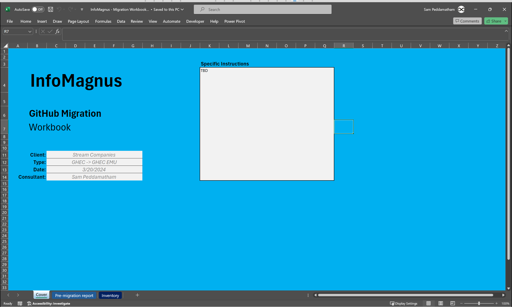
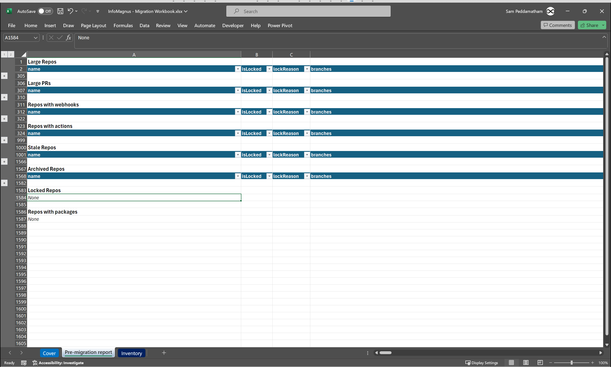

# InfoMagnus GitHub Migration Automator CLI

The IM GitHub Migration Automator is a GitHub CLI-based tool designed to help you plan and execute GitHub-to-GitHub migrations.

Specifically, the tool has been used to help plan and execute the StreamCo and CanacCord GHEC-to-GHEC EMU migrations.

## Overview

`gh migrate` consists of four commands:
- `gh migrate stats` -
- `gh migrate check` -
- `gh migrate diff` -
- `gh migrate plan` -

## Installation

`gh extension install im-infomagnus/gh-migrate`

**NOTE:** This tool is meant to be run in a Visual Studio Code devcontainer or GitHub Codespaces.

## Usage

During an engagement the tool is used as follows:

### Step 1: Start

Begin a migration by forking this repository and `git clone`ing a local copy.

Type `gh migrate start` to create a "migration workbook".

The initialized workbook is placed in `report/InfoMagnus - Migration Workbook.xlsx`.

The "migration workbook" is an Excel workbook which all subsequent `gh migrate` workflows operate around.  The workbook is meant to be a solution to the deluge of files, scripts, logs, versions, etc. which spring forth around migration projects.

It will be your sole data repository and planning tool to complete the migration.

The migration workbook will contain a single sheet, Cover, which you should use to capture and initial high-level information about the engagement.




### Step 2: Generate source / target organization PATs

Personal Access Tokens (PATs) for both the source and target enterprise are required to use `gh migrate`.

The PATs must be of type "classic" with the following permissions: [link](images/pat-perms.png)

Work with your client to generate these tokens.

Store the tokens in your [Bitwarden](https://bitwarden.com/) repository.

### Step 3: Discovery

In this step we generate inventories of the source enterprise:

```bash
gh migrate stats \
    --source-org source-org-1 \
    --source-org source-org-2 \
    --source-pat <source-org-PAT>
```

If the target enterprise is an existing, production environment, then it's important to generate an inventory of it.

This serves as a snapshot and baseline of the client's landscape prior to our engagement.  It is also useful in debugging, triaging, or even rolling-back an engagement.

```bash
gh migrate stats \
    --source-org source-org-1 \
    --source-org source-org-2 \
    --source-pat <source-org-PAT> \
    --target-org target-org-1 \
    --target-org target-org-2 \
    --target-pat <target-org-PAT>
```

### Step 3: Dry-Run Planning

With the inventories gathered, we can begin planning the dry-run, and ultimately the production migration.

To update the migration workbook with the inventory:

```bash
gh migrate update inventory
```

This will create three new sheets:

#### Pre-migration Report



The pre-migration report is used to identify potentially problematic repositories based on our past engagements.

There are typically:
- Repositories larger than 5GB

For more details see...

#### Mapping - Org

...

#### Inventory - Source Repos
...

### Step 4: Dry-Run Execution

Once you've identified which organizations will be part of the dry-run, you can generate the dry-run migration scripts:

```bash
gh migrate scripts dry-run
```

The dry-run script is placed in `scripts/dry-run.sh`, and looks like:

```bash
#!/bin/bash

##########################################
# Capture pre-migration source stats
##########################################
gh migrate stats \
    --source-org "org1" \
    --source-org "org2" \
    --source-pat secret! \
    -o logs/before-source-dry-run-04-16-2024.csv

##########################################
# Migrate!
##########################################
gh gei migrate-org \
    --github-target-enterprise  \
    --github-source-org org1 \
    --github-target-org org1-DRYRUN \
    --github-source-pat secret! \
    --github-target-pat omg! \
    --verbose

gh gei migrate-org \
    --github-target-enterprise  \
    --github-source-org org2 \
    --github-target-org org2-DRYRUN \
    --github-source-pat secret! \
    --github-target-pat omg! \
    --verbose

##########################################
# Capture post-migration source stats
##########################################
gh migrate stats \
    --source-org "org1" \
    --source-org "org2" \
    --source-pat secret! \
    -o logs/after-source-dry-run-04-16-2024.csv

##########################################
# Capture post-migration target stats
##########################################
gh migrate stats \
    --target-org "org1-DRYRUN" \
    --target-org "org2-DRYRUN" \
    --target-pat omg! \
    -o logs/after-target-dry-run-04-16-2024.csv

##########################################
# Capture migration logs
##########################################
gh migrate check \
    --target-org "org1-DRYRUN" \
    --target-org "org2-DRYRUN" \
    --target-pat omg! \
    -o logs
```

For more detail on the process see: [link](docs/migration-process.md)

### Step 5: Dry-Run Analysis

Analysis of the dry-run takes two steps:

1. Analysis of the source and target orgs using the `gh migrate diff` command:

    ```bash
    gh migrate diff \
        logs/before-source-dry-run-04-16-2024.csv \
        logs/after-source-dry-run-04-16-2024.csv \
        logs/after-target-dry-run-04-16-2024.csv \
        "report/InfoMagnus - Migration Workbook.xlsx"
    ```

2. Analysis of the migration logs


## Contributing
See [CONTRIBUTING.md](docs/CONTRIBUTING.md)

## License
[Specify the license under which the tool is distributed]

## Contact
[Provide contact information for support or inquiries]
